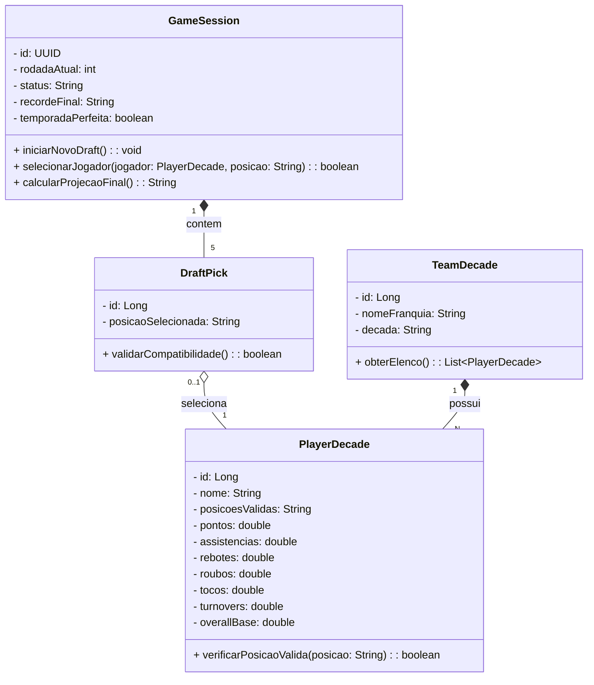
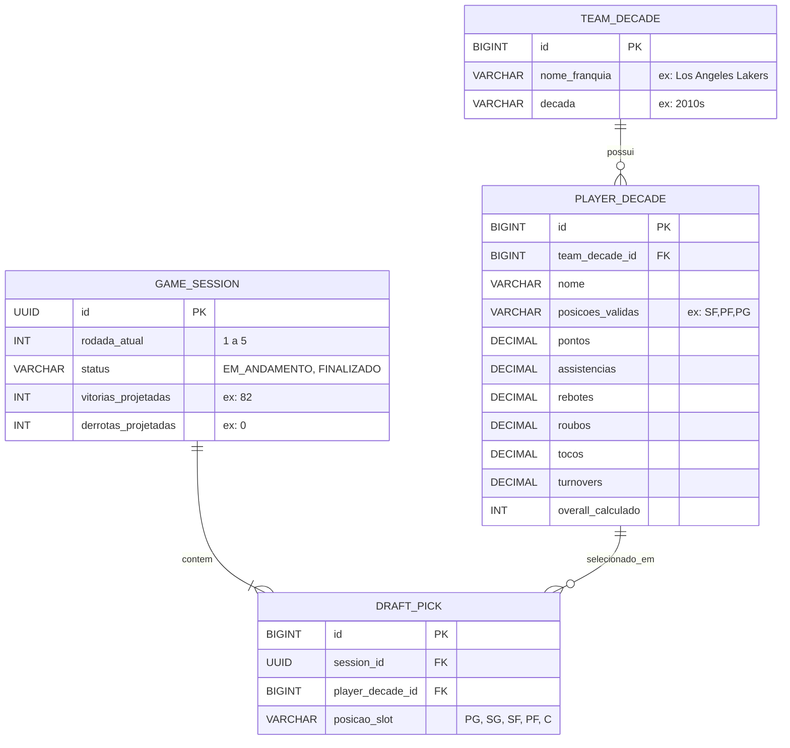

# 🏀 Draft 82 (The Perfect Season)

**Draft 82** é um jogo de simulação e gerenciamento de draft no navegador. O objetivo do jogador é analisar elencos históricos da NBA sorteados aleatoriamente por décadas e montar o quinteto perfeito para tentar bater o recorde absoluto da liga: uma temporada impecável de 82 vitórias e 0 derrotas.

## 🎯 Como Funciona
1. **O Sorteio:** A cada rodada, o sistema fornece uma franquia e uma década histórica específica (ex: *Los Angeles Lakers - Anos 2010*).
2. **A Escolha:** O jogador deve analisar o elenco daquela era e escolher um atleta para preencher uma das 5 posições do quinteto titular (PG, SG, SF, PF, C).
3. **O Rigor Tático:** O sistema bloqueia escalações irreais. Um jogador só pode ser escalado nas posições em que atuou oficialmente naquela década.
4. **O Veredito:** Após as 5 escolhas, um algoritmo de Média Ponderada baseado em estatísticas reais projeta o recorde de vitórias e derrotas da sua equipe.

---

## 🏗️ Arquitetura do Sistema (UML)

O backend foi modelado focando na separação clara entre **dados dimensionais históricos** (imutáveis, importados via CSV) e os **dados transacionais** (a sessão temporária do usuário jogando). 

La validação de regras de negócio (como a verificação de posições válidas) é garantida no servidor pelo Spring Boot.

---

## 🗄️ Modelagem da Base de Dados (ER)

O esquema relacional divide-se em duas partes: tabelas estáticas de consulta (`TEAM_DECADE` e `PLAYER_DECADE`) e tabelas dinâmicas de estado do jogo (`GAME_SESSION` e `DRAFT_PICK`).

---
